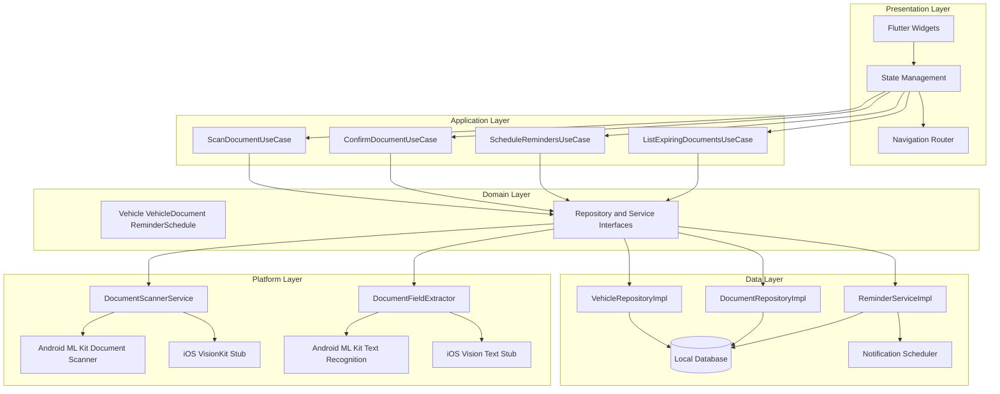
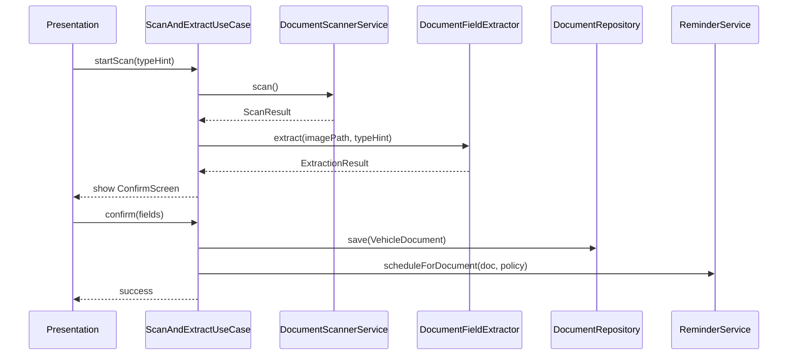

# ClearToDrive — Architecture

**Product:** ClearToDrive  
**Platform:** Flutter (Android MVP, iOS later)  
**Data:** Local-only (no backend)  
**Last updated:** 2026-05-27

---

## Overview

ClearToDrive uses a **layered, ports-and-adapters** architecture in Flutter. Shared UI and business logic live in Dart. Platform-specific document scanning (Android ML Kit Document Scanner, iOS VisionKit) and OCR text recognition sit behind interfaces injected at startup. No layer above **platform** may import ML Kit, VisionKit, or call platform channels directly.

This structure allows shipping Android MVP while adding iOS scanner implementation later without rewriting use cases, domain models, or UI flows.

---

## High-level diagram



---

## Layers

### Presentation

- Flutter widgets, themes, navigation (e.g. `go_router`)
- State management (Riverpod—see [TECH_DECISIONS.md](TECH_DECISIONS.md))
- Romanian UI strings via `AppLocalizations` (keys in English)
- **Must not:** call `DocumentScannerService` implementations directly without going through providers/use cases; parse OCR regex; schedule notifications

### Application

- Use cases orchestrate single user intents
- Coordinate scanner → extractor → confirm → persist → schedule
- Return `Result` / sealed failure types to presentation
- **Must not:** depend on Android/iOS SDKs; embed SQL or notification APIs

### Domain

- Entities, value objects, enums (`DocumentType`: `rca`, `itp`, `rovinieta`)
- Repository interfaces: `VehicleRepository`, `DocumentRepository`
- Service interfaces: `DocumentScannerService`, `DocumentFieldExtractor`, `ReminderService`
- Pure Dart validators: plate normalizer, expiry date rules
- **Must not:** import Flutter material, platform channels, or `dart:io` for behavioral branching

### Data

- Repository implementations backed by local database (Drift)
- `ReminderServiceImpl` using `flutter_local_notifications` + `timezone`
- File storage for optional document images (app documents directory)
- **Must not:** contain UI logic or OCR parsing rules

### Platform

- `DocumentScannerService` Android implementation → ML Kit Document Scanner (when built)
- `DocumentScannerService` iOS implementation → VisionKit via platform channel (stub in MVP)
- `DocumentFieldExtractor` Android → ML Kit Text Recognition + shared rule parser
- `DocumentFieldExtractor` iOS → stub returning empty extraction until Vision text API wired
- **Must not:** reference widgets or navigate

---

## Layer rules summary

| Layer | Owns | Must never |
|-------|------|------------|
| Presentation | Screens, forms, loading/error UI | ML Kit/VisionKit, SQL, notification scheduling |
| Application | Use case orchestration | Platform `if (Platform.isAndroid)` in widgets |
| Domain | Business types, interfaces, validation | Framework imports |
| Data | Persistence, notification adapter | Scanner UI, OCR regex in repos |
| Platform | Native scanner/OCR adapters | Reminder policy, navigation |

---

## Core interfaces

### DocumentScannerService

Abstraction over native document capture UI. Returns cropped images or PDF paths—not parsed fields.

```dart
abstract class DocumentScannerService {
  /// Opens native document scanner (ML Kit on Android, VisionKit on iOS when implemented).
  Future<ScanResult> scan();

  /// Picks image/PDF from gallery. Required for e-policy PDFs and when scanner unavailable.
  Future<ScanResult> pickFromGallery();
}

class ScanResult {
  final List<String> imagePaths;  // cropped JPEG/PNG paths
  final String? pdfPath;          // optional single PDF
}

sealed class ScanFailure {}
class ScanCancelled extends ScanFailure {}
class ScanFailed extends ScanFailure {}
class ScannerUnavailable extends ScanFailure {}  // iOS stub, missing Play Services, etc.
```

**Android (later):** `google_mlkit_document_scanner` wrapped in `AndroidDocumentScannerService`.  
**iOS (later):** `VNDocumentCameraViewController` via method channel in `IosDocumentScannerService`.  
**MVP iOS / tests:** `UnavailableDocumentScannerService` throws `ScannerUnavailable`; UI routes to gallery/manual.

### DocumentFieldExtractor (OcrParser)

Separate from scanner. Takes image bytes or file path; returns suggested fields.

```dart
abstract class DocumentFieldExtractor {
  Future<ExtractionResult> extract({
    required String imagePath,
    DocumentType? typeHint,
  });
}

class ExtractionResult {
  final String? licensePlate;
  final DateTime? expiryDate;
  final DocumentType? suggestedType;
  final double? confidence;       // optional aggregate; MVP may omit
  final String rawText;           // for debug and future parser improvement
}
```

Parsing logic (Romanian date patterns, plate regex, keyword type detection) lives in a **pure Dart** `RomanianDocumentParser` called by platform extractors after text recognition. Same parser runs in unit tests without ML Kit.

### ReminderService

```dart
abstract class ReminderService {
  /// Idempotent: cancels existing schedules for documentId then creates new ones.
  Future<void> scheduleForDocument(VehicleDocument document, ReminderPolicy policy);

  Future<void> cancelForDocument(String documentId);

  Future<List<ReminderSchedule>> getSchedulesForDocument(String documentId);
}

class ReminderPolicy {
  final bool dayOf;
  final Set<int> daysBefore; // e.g. {30, 14, 7, 1}
}
```

Scheduling uses local timezone. Reminder IDs derived from `documentId + offset` for idempotency.

### VehicleRepository

```dart
abstract class VehicleRepository {
  Future<List<Vehicle>> getAll();
  Future<Vehicle?> getById(String id);
  Future<Vehicle?> findByPlate(String normalizedPlate);
  Future<Vehicle> upsert(Vehicle vehicle);
  Future<void> delete(String id);
}
```

### DocumentRepository

```dart
abstract class DocumentRepository {
  Future<List<VehicleDocument>> getAll({String? vehicleId});
  Future<List<VehicleDocument>> getExpiringWithin(Duration window);
  Future<VehicleDocument?> getById(String id);
  Future<VehicleDocument> save(VehicleDocument document);
  Future<void> delete(String id);
}
```

---

## Primary use case flows

### Scan / import → extract → confirm → save → remind



### Manual entry

UI collects fields → `ConfirmDocumentUseCase` skips scanner/OCR → save → schedule.

---

## Platform strategy

### Android (MVP)

| Component | Implementation |
|-----------|----------------|
| Document scanner | ML Kit Document Scanner API via Flutter plugin (when app code phase starts) |
| Text recognition | ML Kit Text Recognition |
| Reminders | `flutter_local_notifications`; request `SCHEDULE_EXACT_ALARM` where needed |
| Storage | Drift on SQLite; images in app documents dir |

### iOS (later)

| Component | Implementation |
|-----------|----------------|
| Document scanner | VisionKit `VNDocumentCameraViewController` via platform channel |
| Text recognition | Vision `VNRecognizeTextRequest` |
| Reminders | `flutter_local_notifications` iOS APIs |
| MVP stub | `ScannerUnavailable` → gallery/manual only; shared domain unchanged (iOS App Store is post-MVP) |

**Rule:** Register implementations in composition root (`main.dart` + DI), not in widgets.

```dart
// Composition root (conceptual)—not implemented yet
void registerPlatformServices(GetIt getIt) {
  getIt.registerLazySingleton<DocumentScannerService>(
    () => Platform.isAndroid
        ? AndroidDocumentScannerService()
        : UnavailableDocumentScannerService(),
  );
}
```

---

## Data model

### Vehicle

| Field | Type | Notes |
|-------|------|-------|
| `id` | String (UUID) | Primary key |
| `displayName` | String? | e.g. "Family car" |
| `licensePlate` | String | Normalized (uppercase, single spaces) |
| `createdAt` | DateTime | UTC stored, local displayed |
| `updatedAt` | DateTime | |

### VehicleDocument

| Field | Type | Notes |
|-------|------|-------|
| `id` | String (UUID) | Primary key |
| `vehicleId` | String | FK → Vehicle |
| `type` | enum | `rca`, `itp`, `rovinieta` |
| `expiryDate` | Date | Date-only semantics (local calendar day) |
| `source` | enum | `scan`, `import`, `manual` |
| `imagePath` | String? | Optional retained scan |
| `confirmedAt` | DateTime | User confirmation timestamp |
| `createdAt` | DateTime | |
| `updatedAt` | DateTime | |

### ReminderSchedule

| Field | Type | Notes |
|-------|------|-------|
| `id` | String | `{documentId}_{offsetDays}` |
| `documentId` | String | FK → VehicleDocument |
| `triggerAt` | DateTime | Local scheduled fire time (morning default, e.g. 09:00) |
| `offsetDays` | int | 30, 14, 7, 1, or 0 for day-of |
| `status` | enum | `scheduled`, `fired`, `cancelled` |
| `notificationId` | int | Platform notification id |

---

## Package layout (proposal)

```
lib/
  main.dart
  app.dart                          # MaterialApp, router, theme, l10n
  core/
    errors/
    result/
    validators/
      license_plate_validator.dart
      expiry_date_validator.dart
  domain/
    entities/
      vehicle.dart
      vehicle_document.dart
      reminder_schedule.dart
    enums/
      document_type.dart
    repositories/
      vehicle_repository.dart
      document_repository.dart
    services/
      document_scanner_service.dart
      document_field_extractor.dart
      reminder_service.dart
  application/
    use_cases/
      scan_and_extract_use_case.dart
      confirm_document_use_case.dart
      schedule_reminders_use_case.dart
      list_expiring_documents_use_case.dart
  data/
    database/
      app_database.dart             # Drift
      tables/
    repositories/
      vehicle_repository_impl.dart
      document_repository_impl.dart
    services/
      reminder_service_impl.dart
    parsers/
      romanian_document_parser.dart # pure Dart
  platform/
    document_scanner/
      android_document_scanner_service.dart
      unavailable_document_scanner_service.dart
      ios_document_scanner_service.dart       # later
    ocr/
      android_document_field_extractor.dart
      ios_document_field_extractor.dart       # later
  presentation/
    router/
    l10n/                             # arb: app_ro.arb (MVP), app_en.arb stub
    features/
      splash/
      onboarding/
      home/
      add_document/
      confirm/
      document_detail/
      manual_entry/
      vehicles/
      settings/
  di/
    injection.dart                    # get_it registration
```

---

## Localization architecture (MVP)

- **Default locale:** Romanian (`ro`); architecture ready for English and Spanish (`en`, `es`) via ARB files
- **Keys:** English snake_case (`confirm_expiry_date`, `document_type_rovinieta`)
- **ARB files:** `app_ro.arb` fully populated for MVP; `app_en.arb` / `app_es.arb` stubs for pipeline validation; fallback to Romanian until EN/ES are translated (see [TECH_DECISIONS.md](TECH_DECISIONS.md) OQ-8)
- Domain enums stay English (`DocumentType.rca`); UI maps via l10n

---

## Architecture risks

| Risk | Impact | Mitigation |
|------|--------|------------|
| ML Kit Document Scanner Android-only | iOS needs separate VisionKit work | Abstract `DocumentScannerService` from day one; iOS stub routes to gallery/manual until VisionKit ships |
| Two native codepaths to maintain | Higher cost at iOS launch | Keep platform layer thin; shared parser and use cases |
| OCR variance across document layouts | User distrust | Mandatory confirm; never auto-save OCR |
| Notification reliability (OEM battery) | Missed reminders | Onboarding + Settings deep link to battery/notification settings |
| Image storage growth | Disk usage | Optional delete-after-confirm (open question) |
| PDF rendering for OCR | Plugin gaps | MVP: rasterize first page or require image import |
| Exact alarm permission (Android 12+) | Reminders slip | Document in TECH_DECISIONS; graceful degrade to inexact |
| Legal liability perception | Reputation | Disclaimers; user-confirmed data is source of truth |

---

## Testing hooks (architecture-level)

- **Unit:** `RomanianDocumentParser`, `ReminderPolicy` date calculator, validators
- **Fake:** `FakeDocumentScannerService`, `FakeDocumentFieldExtractor`, in-memory repos
- **Widget:** Confirm screen with injected fake use case
- **Integration (Android):** Full flow with test fixtures (post-scaffold)

No tests implemented in documentation phase.
