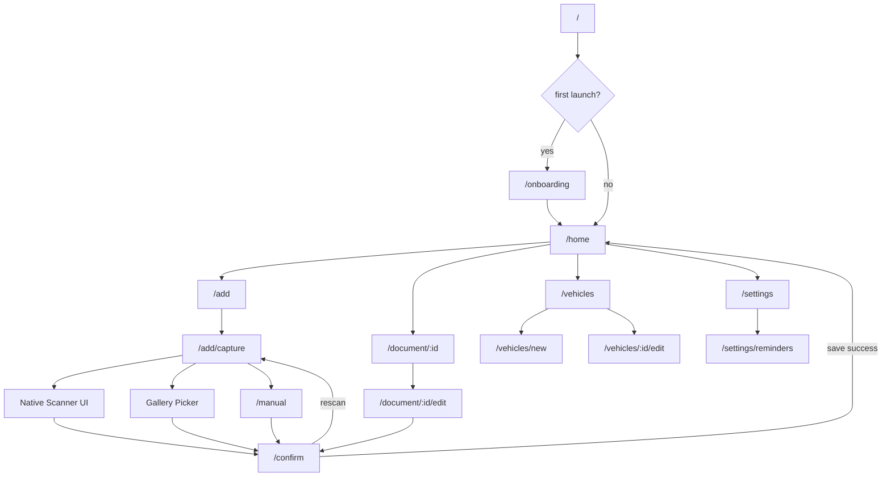

# ClearToDrive — Screens

**Product:** ClearToDrive  
**UI language (MVP):** Romanian-first  
**Navigation:** Declarative routes (e.g. `go_router`)  
**Last updated:** 2026-05-27

---

## Navigation map

---

## Screen inventory

| # | Screen | Route ID | Entry points |
|---|--------|----------|--------------|
| 1 | Splash | `/` | App launch |
| 2 | Onboarding | `/onboarding` | First launch after splash |
| 3 | Home / Dashboard | `/home` | Onboarding complete, back from flows |
| 4 | Add document chooser | `/add` | Home FAB / Add button |
| 5 | Scan or manual entry | `/add/capture` | Add chooser |
| 6 | Confirm extraction | `/confirm` | After scan/import/manual prefill |
| 7 | Document detail | `/document/:id` | Home list tap, notification tap |
| 8 | Manual entry | `/manual` | Add capture → Manual; OCR fail CTA |
| 9 | Vehicles | `/vehicles` | Home app bar / settings link |
| 10 | Settings | `/settings` | Home app bar |
| 11 | Reminder defaults | `/settings/reminders` | Settings row |

Supporting routes (same feature, listed for implementation):

| Screen | Route ID | Parent |
|--------|----------|--------|
| Edit document | `/document/:id/edit` | Document detail |
| Add/edit vehicle form | `/vehicles/new`, `/vehicles/:id/edit` | Vehicles |

---

## 1. Splash

**Route:** `/`  
**Purpose:** Cold start, initialize DI, open database, decide onboarding vs home.

**Key UI elements:**
- ClearToDrive logo / wordmark
- Subtle loading indicator (no blocking copy required)

**Actions:**
- Auto-navigate after init (< 2s target)

**Validation:** None

**States:**
| State | Behavior |
|-------|----------|
| Success | → `/onboarding` if first launch; else `/home` |
| Error (DB fail) | Full-screen error + Retry button |

---

## 2. Onboarding

**Route:** `/onboarding`  
**Purpose:** Explain value, set expectations on OCR and rovinieta, request permissions.

**Key UI elements (Romanian copy plan):**
- Slide 1: "Nu uita de RCA, ITP și Rovinietă" — multi-document reminders
- Slide 2: "Scanezi sau imporți dovada" — not legal verification; confirm dates yourself
- Slide 3: "Rovinietă electronică" — no physical sticker; manual entry or proof screenshot OK
- Slide 4: Permissions — camera (optional if gallery-only), notifications (recommended)
- Primary CTA: Continuă
- Secondary: Sari peste (permissions)

**Actions:**
- Request notification permission
- Request camera permission (optional)
- Mark onboarding complete → `/home`

**Validation:** None blocking

**States:**
| State | Behavior |
|-------|----------|
| Success | Navigate to Home |
| Notification denied | Continue with banner on Home explaining limited reminders |
| Camera denied | Continue; scan button shows gallery/manual emphasis |

---

## 3. Home / Dashboard

**Route:** `/home`  
**Purpose:** Show upcoming expiries across all vehicles, sorted by urgency.

**Key UI elements:**
- App bar: title "Acasă" or ClearToDrive; icons → Settings, Vehicles
- Sorted list: document type label (RCA / ITP / Rovinietă), plate, expiry date, days remaining chip
- Color urgency: expired (red), ≤7 days (amber), >7 days (neutral)
- FAB or prominent button: "Adaugă document"
- Optional filter chip by vehicle
- Notification permission banner if denied

**Actions:**
- Tap row → Document detail
- Add → Add document chooser
- Pull to refresh (reload from local DB)

**Validation:** None

**States:**
| State | UI |
|-------|-----|
| Empty | Illustration + "Niciun document salvat" + CTA Adaugă document |
| Success | Populated list |
| Error (load fail) | Retry |

---

## 4. Add document chooser

**Route:** `/add`  
**Purpose:** User selects document type before capture.

**Key UI elements:**
- Title: "Ce document adaugi?"
- Three type cards/chips: **RCA**, **ITP**, **Rovinietă** (maps to `rca`, `itp`, `rovinieta`)
- Brief hint under Rovinietă: "Introdu manual dacă nu ai o poză cu confirmarea"

**Actions:**
- Select type → `/add/capture` with `typeHint` query param

**Validation:**
- Type selection required before continue

**States:**
| State | UI |
|-------|-----|
| Success | Type selected → capture screen |

---

## 5. Scan or manual entry

**Route:** `/add/capture`  
**Purpose:** Choose capture method for selected document type.

**Key UI elements:**
- Selected type badge (RCA / ITP / Rovinietă)
- Primary button: "Scanează document" (opens native scanner on Android)
- Secondary: "Importă din galerie"
- Tertiary text button: "Introducere manuală"
- Loading overlay during OCR

**Actions:**
- Scan → `DocumentScannerService.scan()` → OCR → `/confirm` with extraction args
- Import → `pickFromGallery()` → OCR → `/confirm`
- Manual → `/manual` with type preselected

**Validation:** None before launch

**States:**
| State | UI |
|-------|-----|
| Loading | "Se analizează documentul…" |
| Scanner cancelled | Stay on screen, no error toast |
| Scanner unavailable (iOS stub) | Inline message + highlight gallery/manual |
| OCR complete | Navigate to Confirm with prefilled fields |
| OCR empty | Navigate to Confirm with empty fields + helper text |

---

## 6. Confirm extraction

**Route:** `/confirm`  
**Purpose:** **Mandatory** user review before save. OCR is suggestion only.

**Key UI elements:**
- Disclaimer banner: "Verifică datele. Aplicația nu înlocuiește documentele oficiale."
- Image preview (thumbnail, zoom optional)
- Document type dropdown: RCA, ITP, Rovinietă
- License plate field with RO format hint (e.g. `B 123 ABC`)
- Expiry date picker (calendar, `dd.MM.yyyy` display)
- Vehicle selector: existing vehicle by plate or "Mașină nouă"
- Buttons: **Salvează** (primary), **Scanează din nou** (secondary)

**Actions:**
- Save → persist vehicle if new → save document → schedule reminders → `/home` with success snackbar
- Rescan → back to `/add/capture`

**Validation rules:**
| Field | Rule |
|-------|------|
| Document type | Required |
| License plate | Required; normalize uppercase; min length 4; RO pattern soft validation (warn, don't block exotic plates) |
| Expiry date | Required; must be valid calendar date; warn if in past ("Document expirat?") but allow save |
| Vehicle | Required (explicit or auto-created from plate) |

**States:**
| State | UI |
|-------|-----|
| Prefilled from OCR | Fields populated; editable |
| Empty OCR | Empty fields; copy "Completează manual" |
| Saving | Disable form + progress |
| Success | Snackbar "Document salvat" → Home |
| Save error | Inline error + Retry |

---

## 7. Document detail

**Route:** `/document/:id`  
**Purpose:** View saved document, reminder status, edit or delete.

**Key UI elements:**
- Type label + plate
- Large expiry date + countdown ("Expiră în X zile" / "Expirat")
- Source badge: Scan / Import / Manual
- Image thumbnail if stored
- Reminder list: scheduled offsets with dates (read-only in MVP)
- Actions: Editează, Șterge

**Actions:**
- Edit → `/document/:id/edit` (same form as Confirm)
- Delete → confirm dialog → cancel reminders → delete → Home

**Validation:** Delete requires confirmation dialog

**States:**
| State | UI |
|-------|-----|
| Success | Full detail |
| Not found | Error + back to Home |
| Deleted | Navigate Home |

---

## 8. Manual entry

**Route:** `/manual`  
**Purpose:** Add document without scan (required for rovinieta and OCR failures).

**Key UI elements:**
- Same fields as Confirm screen (type, plate, expiry, vehicle)
- No image preview unless optional "Adaugă poză" (gallery, optional MVP)
- Primary: **Salvează**

**Actions:**
- Save → same pipeline as Confirm (skip OCR)

**Validation:** Same as Confirm

**States:**
| State | UI |
|-------|-----|
| Success | → Home with snackbar |
| Validation error | Inline field errors |

---

## 9. Vehicles

**Route:** `/vehicles`  
**Purpose:** Manage vehicles (plates) for filtering and association.

**Key UI elements:**
- List: plate, optional display name, document count
- FAB: Adaugă mașină
- Swipe or menu: Editează, Șterge (block delete if documents exist—require reassign or delete docs first)

**Actions:**
- Add → `/vehicles/new` form (plate, display name)
- Edit → `/vehicles/:id/edit`
- Tap → filter Home by vehicle (optional MVP: navigate Home with filter query)

**Validation:**
| Field | Rule |
|-------|------|
| Plate | Required; unique normalized plate |

**States:**
| State | UI |
|-------|-----|
| Empty | "Nicio mașină" + CTA (optional—documents can auto-create vehicle on confirm) |
| Success | List |
| Delete blocked | Dialog explaining linked documents |

---

## 10. Settings

**Route:** `/settings`  
**Purpose:** App preferences and system permission guidance.

**Key UI elements:**
- Row: **Memento expirare** → Reminder defaults
- Row: Notificări — status (activate/deactivate) + link to system settings
- Row: Baterie / optimizare (Android) — helper text for OEM battery kill
- Version number
- Disclaimer link: "Datele rămân pe telefon"

**Actions:**
- Open system notification settings
- Navigate to Reminder defaults

**Validation:** None

**States:**
| State | UI |
|-------|-----|
| Notifications off | Warning banner with enable CTA |

---

## 11. Reminder defaults

**Route:** `/settings/reminders`  
**Purpose:** Configure default offsets for **new** documents.

**Key UI elements:**
- Toggles:
  - 30 zile înainte (default ON)
  - 14 zile înainte (default ON)
  - 7 zile înainte (default ON)
  - 1 zi înainte (default ON)
  - În ziua expirării (default OFF)
- Helper: "Se aplică documentelor noi. Editează un document pentru a reprograma."

**Actions:**
- Toggle → persist to local preferences store

**Validation:**
- At least one offset must remain enabled (including day-of)

**States:**
| State | UI |
|-------|-----|
| Last toggle off attempt | Snackbar "Selectează cel puțin un memento" |
| Success | Immediate save |

---

## Global UX principles

1. **Confirm always** — no auto-save from OCR
2. **Show source image** when available on Confirm and Detail
3. **Romanian labels** for document types in UI; English in code
4. **Large dates** — expiry is the hero information
5. **Offline-first** — no empty states that suggest "sync" or "login"
6. **Honest rovinieta copy** — never reference windshield sticker

---

## Out-of-scope screens (do not build in MVP)

- Paywall / subscription
- Map / GPS
- Chat / AI assistant
- Fleet admin dashboard
- Account login / register
- Cloud backup
- Widget configuration

---

## Notification tap behavior

When user taps a reminder notification:
- Deep link to `/document/:id` for the referenced document
- If document deleted, show Home with "Documentul nu mai există"

---

## Accessibility (MVP baseline)

- Minimum touch target 48dp
- Semantic labels on type chips and date picker
- Sufficient contrast on urgency colors (WCAG AA target)

---

## Risks (UX)

| Risk | Mitigation in screens |
|------|------------------------|
| Users skip confirm carelessly | Disclaimer + expiry is primary field |
| Rovinieta sticker expectation | Onboarding slide + Add chooser hint |
| Permission denial silent failure | Banners on Home and Settings |
| Empty dashboard after install | Strong empty state CTA |
